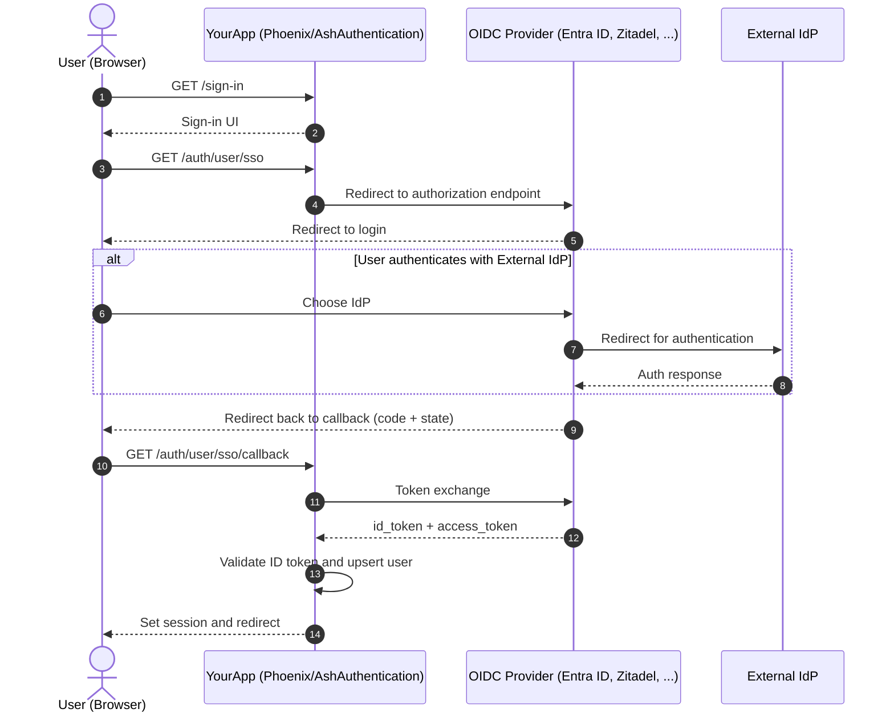

# Ash + Phoenix Template

This repository is a starter template for Phoenix v1.8 apps built with Ash, LiveView, and Oban. Use it as a foundation and tailor it to your project.

## Quick start with your templated application

add a `.env` file (see `.env.example` for an example) to have all env variables in place.

- Run `mix deps.get`
- Run `mix compile`
- Run `mix template.setup MyNewApp` The task updates modules, OTP app name, file paths, Helm chart names and more. It then deletes itself, discards the template's git history and creates a fresh initial commit (pass `--no-git` to keep the history).
- Run `mix setup` to install and set up dependencies
- Run `mix precommit` to update assets and localizations if necessary
- Start the Phoenix endpoint with `mix phx.server` or `iex -S mix phx.server`
- Visit <http://localhost:4000>
- Adapt the `.github` workflow files to your needs
- If you want to use the recommended deployment-repository-approach using argoCD, read [here](https://wiki.zebbra.ch/doc/cicd-S1M57eqWNk) how to configure it and update the `.github/workflows/cicd.yml` accordingly.
- For further questions ask in the dev-community slack channel

### Dashboards

- Admin Dashboard: <http://localhost:4000/admin>
- Oban Dashboard: <http://localhost:4000/oban>
- Dev Dashboard: <http://localhost:4000/dev/dashboard>

## What is included

- Phoenix 1.8 + LiveView
- Ash framework with AshAuthentication and AshAdmin
- Oban and Oban Web
- Tailwind v4 and bun (no node/npm required)
- Dockerfile and Helm chart
- GitHub Actions CI

## Authentication (Magic Link + optional OIDC SSO)

This template ships with magic link authentication plus an optional, IdP-agnostic OIDC strategy named `:sso` via AshAuthentication. It works with any spec-compliant OIDC provider — Microsoft Entra ID (M365) and Zitadel are the tested paths.

**important**:
Before you can use the OIDC strategy, you need an OIDC client at your identity provider (an "app registration" in Entra ID, an "application" in Zitadel). If you're doing this the first time or you don't have sufficient permissions, ask in the dev-community slack channel or your favourite CISO ;-)

OIDC SSO is a **compile-time** decision: when `OIDC_ENABLED=true` at build time, the `:sso` strategy (and its sign-in button) is compiled into the `User` resource; otherwise it does not exist and the sign-in page offers magic link only. Apps run either with OIDC or without — toggling it requires a rebuild (`OIDC_ENABLED` is a Docker build arg).

Environment variables (set `OIDC_ENABLED` identically at build time and runtime; when enabled, all required variables must be set at runtime — a mismatch fails the boot):

- `OIDC_ENABLED`: `true` to compile in and enable OIDC SSO, unset/`false` to disable it
- `OIDC_ISSUER`: issuer/base URL, used for OIDC discovery
- `OIDC_CLIENT_ID`: OIDC client id
- `OIDC_CLIENT_SECRET`: OIDC client secret
- `OIDC_REDIRECT_URI`: callback URL, e.g. `https://myapp.example.com/auth/user/sso/callback`
- `OIDC_TRUSTED_AUDIENCES` (optional): comma-separated extra audiences trusted during ID token validation, beyond the client id

Provider notes:

- **Microsoft Entra ID (M365)**: `OIDC_ISSUER` is `https://login.microsoftonline.com/<tenant-id>/v2.0`. No trusted audiences needed. App roles assigned in the app registration arrive as a standard `roles` list claim and are mapped to `User.roles`. Entra ID may omit the `email` claim depending on account type — ensure the `email` claim is configured, since registration upserts on email.
- **Zitadel**: `OIDC_ISSUER` is your Zitadel domain. Set `OIDC_TRUSTED_AUDIENCES` to the Zitadel project id. Project roles arrive under the `urn:zitadel:iam:org:project:roles` claim and are mapped to `User.roles`.

High level flow:

- Entry point: `/sign-in` -> Sign in with SSO
- OIDC endpoints are generated by `AshAuthentication.Phoenix` under `/auth`
- Strategy config lives in `Accounts.User` as `oidc :sso`
- On callback, AshAuthentication validates state and nonce, then upserts the user

