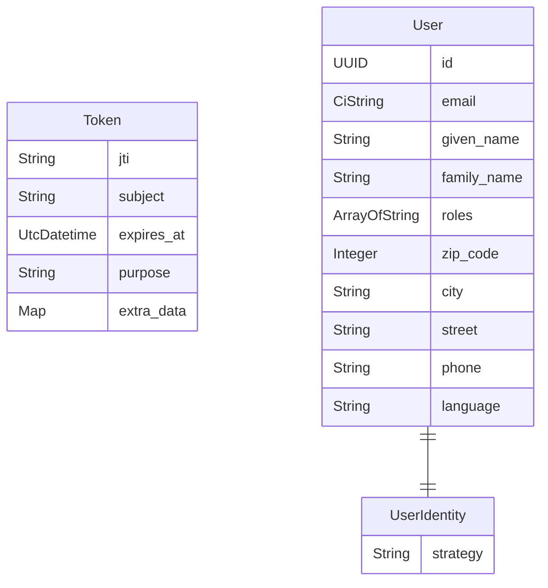

```mermaid
erDiagram
    "Token" {
        String jti
        String subject
        UtcDatetime expires_at
        String purpose
        Map extra_data
    }
    "User" {
        UUID id
        CiString email
        String given_name
        String family_name
        ArrayOfString roles
        Integer zip_code
        String city
        String street
        String phone
        String language
    }
    "UserIdentity" {
        String strategy
    }

    "User" ||--|| "UserIdentity" : ""

```
